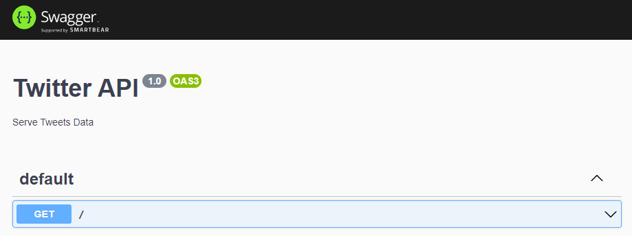

# NestJS REST API com Prisma
Por <a href="https://www.linkedin.com/in/chanelym/">Chanely Marques</a> & <a href="https://www.linkedin.com/in/bernardofnoro/">Bernardo Freitas</a>

## Sobre

:dart: Configuração do Prisma com PostgreSQL

:dart: Integração do Prisma com NetsJS

:dart: API REST com CRUD

:dart: Autenticação com JWT

:dart: Manipulação de erros do Prisma utilizando os filtros de exceções do NestJS

## Nossas Ferramentas

:wrench: **Node.js** - LTS Version: **16.13.1**

[Download](https://nodejs.org/en/download/)

[Documentação](https://nodejs.org/en/docs/)

:wrench: **NestJS** - Version: 8.2.4

[Documentação](https://docs.nestjs.com/)

:wrench: **Prisma**

[Documentação](https://www.prisma.io/docs/)

:wrench: **PostgreSQL** - Version **14.1**

[Download](https://www.enterprisedb.com/downloads/postgres-postgresql-downloads)

[Documentação](https://www.postgresql.org/docs/14/release-14.html)

## NestJS

O NestJS é um framework utilizado na construção de aplicações _server-side_ em Node.js de forma eficiente e escalável, podendo utilizar o Express ou Fastify como servidores HTTP.

O NestJS nos permite construir APIs REST ou GraphQL.

Sua arquitetura é muito inspirada na do Angular, contendo:

- **Módulos** que organizam e delimitam, eles agrupam os controladores (**_controllers_**), resolvedores (**_resolvers_**) e os serviços (**_services_**). 

  ```bash
  nest generate module
  ```

- **Controllers** que são utilizados para configuração dos nossos _endpoints_. 

  ```bash
  nest generate controller
  ```

- **Resolvers** para definir as _queries_ do GraphQL

  ```bash
  nest generate resolver
  ```

- **Services** que implementam e isolam a lógica de negócio

  ```bash
  nest generate service
  ```

### Configurando o ambiente

 :smiley_cat: :pencil2: Clone o repositório do seu projeto no GitHub

 :smiley_cat: :pencil2: Acesse a pasta clonada e instale a NestJS CLI

```
npm i -g @nestjs/cli
```

 :smiley_cat: :pencil2: Crie a pasta para o projeto que vamos construir

```bash
nest new twitter
cd twitter
```

> **_Nota_** :bangbang: Caso encontre o erro `Failed to execute command: npm install --silent`, apague a pasta **twitter** e execute a sequência de comandos abaixo:

```bash
npm cache clean --force
npm i -g source-map-resolve
npm i -g @nestjs/cli
nest new twitter
```

 :smiley_cat: :pencil2: Instale e configure o _Swagger_:

```bash
npm i @nestjs/swagger class-transformer class-validator swagger-ui-express
```

Após a instalação acesse o arquivo `main.ts` para configurar o _swagger_:

```typescript
import { NestFactory } from '@nestjs/core';
import { AppModule } from './app.module';
import { DocumentBuilder, SwaggerModule } from '@nestjs/swagger';

async function bootstrap() {
  const app = await NestFactory.create(AppModule);

  const config = new DocumentBuilder()
    .setTitle('Twitter API')
    .setDescription('Serve Tweets Data')
    .setVersion('1.0')
    .build();
  const document = SwaggerModule.createDocument(app, config);
  SwaggerModule.setup('api/v1/doc', app, document); // aqui defino o endereço do swagger

  await app.listen(3000);
}
bootstrap();

```

Vamos aproveitar para fazer alguns ajustes no arquivo `.eslintrc.js`:

```javascript
module.exports = {
  parser: '@typescript-eslint/parser',
  parserOptions: {
    project: 'twitter/tsconfig.json', // correcting path
    sourceType: 'module',
  },
  plugins: ['@typescript-eslint/eslint-plugin'],
  extends: [
    'plugin:@typescript-eslint/recommended',
    'plugin:prettier/recommended',
  ],
  exclude: [
    'node_modules',
    'test',
    'dist',
    '**/*spec.ts',
    'tweets.ts', // exclude seed file
    'prisma', // exclude prisma directory
  ],
  root: true,
  env: {
    node: true,
    jest: true,
  },
  ignorePatterns: ['.eslintrc.js'],
  rules: {
    '@typescript-eslint/interface-name-prefix': 'off',
    '@typescript-eslint/explicit-function-return-type': 'off',
    '@typescript-eslint/explicit-module-boundary-types': 'off',
    '@typescript-eslint/no-explicit-any': 'off',
  },
};


```

Podemos iniciar nossa API com o comando `npm run start:dev` para testar o _swagger_ executando em:

- `localhost:3000/api/v1/doc`



## Configuração do Prisma com PostgreSQL

Agora que colocamos parte do ambiente em ordem e instalamos as dependência, precisamos adicionar o Prisma ao projeto instalando-o como dependência de desenvolvimento, inicializar o _schema_ e instalar a `@prisma/client`.

```bash
npm install prisma --save-dev
npx prisma init --datasource-provider postgresql

npm install @prisma/client
```

Quando utilizamos o parâmetro `init` para o Prisma, estamos criando um diretório chamado **prisma** contendo o arquivo `schema.prisma` que é fundamental para o seu funcionamento:

```javascript
// This is your Prisma schema file,
// learn more about it in the docs: https://pris.ly/d/prisma-schema

generator client {
  provider = "prisma-client-js"
}

datasource db {
  provider = "postgresql"
  url      = env("DATABASE_URL")
}

```

Precisamos criar um modelo para o nosso banco de dados onde representaremos nossas tabelas. Como estamos construindo uma API que servirá dados de uma rede social, faremos uma representação para o _Twitter_ como exemplo:

```typescript
model User {
  Id          Int    @id   @default(autoincrement())
  name        String
  surname     String
  username    String    @unique
  password    String
  about       String
  birthday    String
  people      People[]
  tweet       Tweet[]
  favoriteTweet favoriteTweet[]
  createdAt   DateTime  @default(now()) @map("created_at")
}

model Tweet {
  Id          Int    @id   @default(autoincrement())
  content     String
  likes       Int
  userId      Int
  user        User[]    @relation(fields: [userId], references: [Id])
  favoriteTweet favoriteTweet[]
  createdAt   DateTime  @default(now()) @map("created_at")
}
model People {
  Id          Int      @id   @default(autoincrement())
  userId      Int
  user        User[]      @relation(fields: [userId], references: [Id])
  followerId  Int
  follower    Follower[]  @relation(fields: [followerId], references: [Id])
  followingId  Int
  following    Following[]  @relation(fields: [followingId], references: [Id])
  createdAt   DateTime    @default(now()) @map("created_at")
}

model Follower {
  Id          Int    @id   @default(autoincrement())
  follower    String
  People      People[]
  createdAt   DateTime  @default(now()) @map("created_at")
}
model Following {
  Id          Int    @id   @default(autoincrement())
  followee    String
  People      People[]
  createdAt   DateTime  @default(now()) @map("created_at")
}

model favoriteTweet {
  Id          Int    @id   @default(autoincrement())
  userId      Int
  user        User[]      @relation(fields: [userId], references: [Id])
  tweetId      Int
  tweet        Tweet[]      @relation(fields: [tweetId], references: [Id])
  createdAt   DateTime  @default(now()) @map("created_at")
}
```


## REST API


## Manipulação de Erros


## Autenticação

